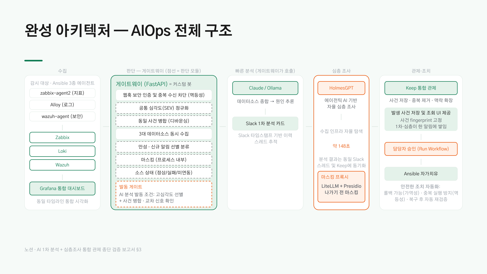

# kinx-idc-monitoring-poc — IDC 관측 파이프라인 고도화 PoC

IDC 관측 시스템(Zabbix + Grafana/Alloy + Wazuh) 고도화를 위해 3주간 진행된 PoC(Proof of Concept)의 최종 산출물 및 기술 명세서입니다.

운영 환경을 읽기 전용 API 기반으로 정찰 및 진단하여 핵심 결함을 식별하였으며, 운영 인프라 변경 없이 독립된 실험 인프라(미러 랩) 환경에서 통합 관제, AI 기반 초동 분석, 승인 기반 자가 치유 파이프라인을 재현 가능한 형태로 검증하였습니다.

본 저장소에는 랩 환경 재구축 및 후속 개발에 필요한 기술 자산만 포함되어 있습니다. (실환경 정찰 데이터, 분석 전략, 인증 자격 증명 등은 `private/` 디렉토리로 격리 보관되며 버전 관리에서 제외됩니다.)

---

## 1. 문서 탐색 가이드

| 수행 목적 및 작업 내용 | 참조 문서 경로 |
|---|---|
| 실험 인프라(랩) 최초 구축 및 프로비저닝 | [`docs/01-build/README.md`](docs/01-build/README.md) |
| 데모 시나리오 실행 및 리허설 가이드 | [`docs/04-demo/runbook.md`](docs/04-demo/runbook.md) |
| 장애 트러블슈팅 및 예외 조치 | [`docs/04-demo/runbook.md §7`](docs/04-demo/runbook.md#7-주요-장애-현상별-트러블슈팅-가이드) |
| 아키텍처 설계 배경 및 의사결정 기록(ADR) | [`docs/02-design/README.md`](docs/02-design/README.md) |
| 시스템 구조적 한계 및 설계 갭 확인 | [`docs/03-pitfalls/README.md`](docs/03-pitfalls/README.md) |
| 후속 개발 및 인수인계 현황 확인 | [`docs/05-handover/status.md`](docs/05-handover/status.md) |

*전체 문서 구조 및 작성 규약: [`docs/README.md`](docs/README.md) 참조*

---

## 2. 시스템 구성 및 설계 원칙



*(게이트웨이 내부 점선 영역은 판단 제어 모듈이며, 각 구성 요소의 세부 매핑은 [`docs/00-architecture.md`](docs/00-architecture.md) 참조)*

### 핵심 설계 원칙
1. **호스트 식별자 FQDN 정규화:** 3개 관측 시스템(Zabbix, Loki, Wazuh)의 호스트 표기 방식을 일치시켜 단일 관측 뷰 및 단일 인시던트 병합 기반을 제공합니다.
2. **결정론적 선판정 및 LLM 인과 설명 분리:** 알림 병합 규칙 및 과거 이력 선판정(만성/신규)은 코드 로직이 전담하여 환각(Hallucination)을 원천 차단하고, LLM은 분석 결과의 인과관계 설명 생성을 담당합니다.
3. **단일 이그레스 경로 및 가명화:** 외부 LLM으로 송신되는 모든 데이터 트래픽은 단일 이그레스 게이트웨이를 경과하며, 가역적 데이터 마스킹 및 화이트리스트 정책을 통과합니다.

---

## 3. 저장소 구성 명세

| 디렉토리 | 담당 역할 및 주요 구성 | 대표 안내 문서 | 구현 상태 |
|---|---|---|---|
| `lab/` | Docker 관측 코어 (Zabbix 7.0.27, MariaDB, Grafana, Loki), 대시보드 7종, DB 복제 스크립트 | [`lab/README.md`](lab/README.md) · [`lab/grafana/USE_RED_GUIDE.md`](lab/grafana/USE_RED_GUIDE.md) | **랩 실증** |
| `ansible/` | 3종 에이전트 자동 배포/등록, DB 복제 감시, Wazuh 룰, 인증서 만료 감시, MSP 온보딩, 조치 플레이북 | [`ansible/DEPLOY_GUIDE.md`](ansible/DEPLOY_GUIDE.md) | **랩 실증** |
| `bot/` | 통합 게이트웨이 파이프라인 (웹훅, 병합, 선판정, 마스킹, LLM 어댑터, Slack, Keep, MSP 월간 리포트) | [`bot/GATEWAY_GUIDE.md`](bot/GATEWAY_GUIDE.md) · [`bot/.env.example`](bot/.env.example) | **랩 실증** |
| `chaos/` | 장애 주입 시뮬레이터 (Brute-force, 서비스 중단, DB 복제 지연, 로그 오류율, SNMP 노이즈, 보안 시드) | [`chaos/README.md`](chaos/README.md) | **랩 실증** |
| `keep/` | HITL 승인 및 자가 치유 연동 워크플로 (Keep ➔ SSH ➔ Ansible) | [`keep/KEEP_GUIDE.md`](keep/KEEP_GUIDE.md) | **랩 실증** |
| `tools/` | Zabbix 읽기 전용(`.get`) 인프라 정찰 스크립트 | [`tools/RECON_GUIDE.md`](tools/RECON_GUIDE.md) | **실환경 정찰** |
| `masking/` | Presidio + LiteLLM 이그레스 가명화 프록시 파이프라인 | [`masking/MASKING_GUIDE.md`](masking/MASKING_GUIDE.md) | **코드 있음·미실증** |
| `docs/` | 인수인계, 재현 절차, 아키텍처 의사결정 기록(ADR) 문서 | [`docs/README.md`](docs/README.md) | — |

*구현 상태 정의: **랩 실증** (End-to-End 전체 동작 검증 완료) / **코드 있음·미실증** (코드 구현 완료, 통합 검증 대기) / **미구현** (설계 검토 단계)*

---

## 4. 시연 시나리오 (Demo Scenarios)

| 구분 | 데모 A — 통합 관제 | 데모 B — 자가 치유 | 데모 C — AI 초동 분석 |
|---|---|---|---|
| **검증 핵심** | 동일 호스트/동일 타임라인 상의 메트릭·로그·보안 지표 시각화 및 패널 간 드릴다운 | 서비스 중단 ➔ HITL 승인 큐 등록 ➔ 단일 승인 실행 ➔ Ansible 자동 재기동 및 재검증 | 분산 수신된 알림 N건의 단일 인시던트 병합 및 "DB 자원 경합" 원인 재프레이밍 |
| **장애 주입** | `chaos/ssh_bruteforce.sh` | `chaos/service_down.sh` | `chaos/repl_lag_contention.sh` |
| **확인 화면** | Grafana `kinx-overview` 대시보드 | Keep 승인 큐 ➔ 워크플로 실행 로그 | Slack 스레드 병합 카드 |
| **실행 가이드** | [시나리오 B 런북](docs/04-demo/runbook.md#3-시나리오-b--ssh-무차별-대입-공격-데모-a-보안-관측-축) | [시나리오 C 런북](docs/04-demo/runbook.md#4-시나리오-c--자가-치유-데모-b-hitl-승인-기반-조치) | [시나리오 A 런북](docs/04-demo/runbook.md#2-시나리오-a--db-복제-지연-및-자원-경합-데모-c-ai-초동-분석) |

*시나리오 설계 세부 사항 및 질의응답 대책: [`docs/04-demo/`](docs/04-demo/README.md) 참조*

---

## 5. 실험 인프라(랩) 주요 실측 지표

*본 수치는 실험 인프라(랩) 환경에서 측정된 실측값입니다.*

- **AI 초동 분석 처리 지연 시간(Latency):** 총 **15.77초** 소요 (컨텍스트 수집 0.16초 + LLM 연산 15.03초 + Slack 전송 0.58초 / 목표 예산 30초 만족)
- **DB 복제 지연 시뮬레이션:** 자원 경합 주입 시 지연 시간 **0초 ➔ 6분 13초** 단조 증가 및 동일 호스트 알림 2건의 **단일 인시던트 자동 병합** 확인
- **SCA 설정 준수율:** **52.0%** (Wazuh CIS 벤치마크, Indexer 직접 조회 및 리포트 집계 검증)
- **HolmesGPT 심층 조사 연동 평가:** 동일 시나리오 실측 소요 시간 약 **148초** (30회 API 호출) ➔ 분석 깊이는 우수하나 실시간 지연 시간 및 마스킹 제약으로 인해 **하이브리드 방식** 채택
- **게이트웨이 검증:** `cd bot && python -m gateway.selftest` 단위 테스트 통과

---

## 6. 기술적 한계 및 제약 사항

*(상세 내용: [`docs/03-pitfalls/`](docs/03-pitfalls/README.md) 참조)*

- **게이트웨이 단일 장애점(SPOF):** 게이트웨이 데몬 미기동 시 알림 수집 및 통보 파이프라인이 중단됩니다.
- **인메모리 인시던트 버퍼:** 알림 병합 버퍼가 인메모리 구조로 관리되어 프로세스 재기동 시 디바운스 대기 중인 인시던트가 유실됩니다.
- **결정론적 규칙 의존성:** 알림 병합 및 만성/신규 선판정 로직은 사전 정의된 규칙 기반으로 구동되며, LLM의 자율 추론 결과가 아닙니다 (LLM 환각 방지를 위한 의도적 설계).
- **검증 범위:** 본 저장소의 모든 실증 및 측정 결과는 실험 인프라(랩) 환경 범위 내에서 유효합니다.

---

## 7. 관측 코어 빠른 실행 가이드

```bash
cd lab
cp .env.example .env      # 랩 전용 임의 자격 증명 설정
docker compose up -d
docker compose logs -f zabbix-server   # "server #0 started" 구문 확인
```

*전체 인프라 단계별 구축 가이드(에이전트, Wazuh, 게이트웨이, Keep): [`docs/01-build/README.md`](docs/01-build/README.md) 참조*

---

## 8. 보안 및 데이터 취급 규약

- **보안 자격 증명 격리:** 자격 증명 정보는 `.env` 파일에만 보관하며, Git 저장소에는 `.env.example` 템플릿만 버전 관리합니다.
- **실환경 데이터 격리:** 실환경 정찰 결과, 인터뷰 기록, 리포트 산출물 등은 `private/` 디렉토리에 격리하여 버전 관리에서 엄격히 제외합니다.
- **IP 주소 표기 규약:** 기술 문서 내 IP 주소는 RFC 5737 문서용 대역(`192.0.2.0/24`)을 예시 주소로 사용합니다. (실제 랩 주소는 `*.local.*` 파일로 관리)
- **읽기 전용 정찰 도구 규약:** `tools/` 내 스크립트는 읽기 전용 API(`.get`)만 호출하며, 실행 결과는 `private/` 디렉토리에 보관합니다.
- **인증서 및 키 파일 반출 금지:** 인증서 및 개인키 파일(`*.pem`, `*.key`, `*.p12`, `*.crt`)과 생성된 PDF 산출물은 저장소 커밋을 엄격히 금지합니다.

---

## 9. 라이선스

사내 전용 (Proprietary). 무단 외부 배포 및 공개를 금지합니다.