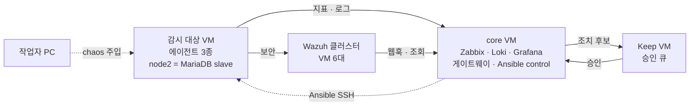
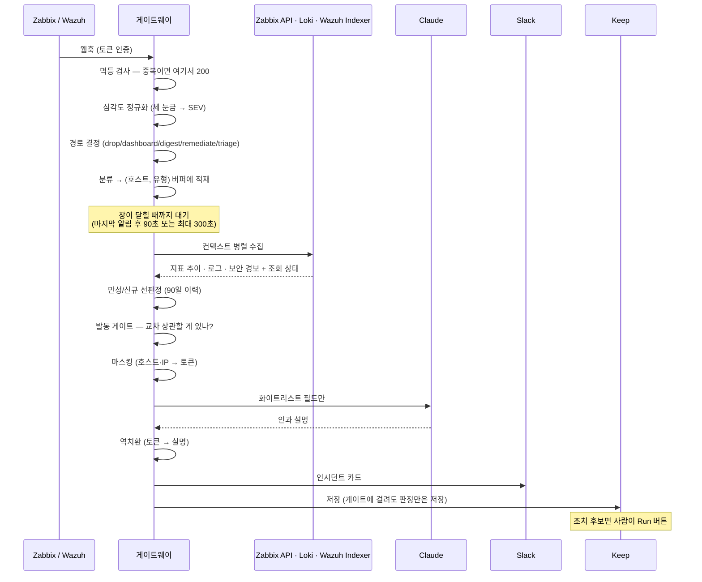

# 구조 — 무엇이 어디에 있고 알림 하나가 어떻게 흐르는가

코드를 고치기 전에 이 문서를 봅니다. 세부 배선은 각 디렉토리의 가이드에 있고, 여기는
**전체 모양과 용어**입니다.

## 1. 전체 구조 한 장

**읽는 법** — 왼쪽에서 오른쪽으로 알림 하나가 흐릅니다. 가운데 게이트웨이 안의 **점선 상자가
판단 모듈**이고, 실선은 그 앞뒤의 수집·통신입니다. 판단이 전부 코드이고 LLM은 그 뒤에서
설명만 쓴다는 것이 이 그림의 요점입니다.

빠른 분석(Claude/Ollama)과 심층 조사(HolmesGPT)가 **다른 칸에 있는 이유**는 시간 예산이 다르기
때문입니다. 앞은 30초 안에 사람에게 첫 답을 주고, 뒤는 분 단위로 돌면서 결과를 같은 스레드에
덧붙입니다. 둘 중 하나를 고른 것이 아니라 역할을 나눈 것입니다.

### 각 칸을 자세히 보려면

이 그림은 지도이고, 실제 정의는 아래 문서들이 갖고 있습니다. **같은 내용을 여기서 다시 쓰지
않습니다.**

| 그림의 칸 | 무엇을 보나 | 문서 |
|---|---|---|
| 수집 (에이전트 3종) | 배포·자동등록·FQDN 정규화 | [`ansible/DEPLOY_GUIDE.md`](../ansible/DEPLOY_GUIDE.md) |
| 수집 (Zabbix·Loki·Wazuh·Grafana) | 구축 절차·데이터소스·대시보드 | [`01-build/01-observability-core.md`](01-build/01-observability-core.md) |
| 판단 — 심각도 정규화 | 세 눈금을 SEV 하나로 (사내/MSP 비대칭) | [`02-design/severity-normalization.md`](02-design/severity-normalization.md) |
| 판단 — 병합·선별·발동 게이트 | 규칙 전수와 순서 | [`02-design/rules-inventory.md`](02-design/rules-inventory.md) |
| 판단 — 마스킹·소스 상태 | 무엇을 내보내고 무엇을 안 내보내나 | [`02-design/llm-data-contract.md`](02-design/llm-data-contract.md) |
| 빠른 분석 | 모델 경로·폴백·열화 | [`02-design/decisions/adr-005-llm-path.md`](02-design/decisions/adr-005-llm-path.md) |
| 심층 조사 | 왜 도입이 아니라 하이브리드인가 | [`02-design/decisions/adr-002-holmesgpt.md`](02-design/decisions/adr-002-holmesgpt.md) |
| 관제·조치 | 승인 게이트와 조치 후 재검증 | [`keep/KEEP_GUIDE.md`](../keep/KEEP_GUIDE.md) |

이 그림이 **보여주지 않는 것**도 있습니다. 어느 VM에 무엇이 올라가는지는 §2, 시간 순서와
대기(디바운스)는 §3, 그리고 이 구조의 약점은 [`03-pitfalls/`](03-pitfalls/README.md)입니다.

## 2. 랩 토폴로지

§1이 **신호가 어떻게 흐르는가**라면, 여기는 **그것이 어느 장비에 올라가 있는가**입니다.

| VM | 올라가 있는 것 | 왜 거기인가 |
|---|---|---|
| **core** | Zabbix + MariaDB · Loki · Grafana · 게이트웨이 · Ansible control node | 관측 코어를 compose 하나로 묶고, 게이트웨이가 그 API를 로컬에서 부른다. Ansible control 을 여기 둔 것은 **감시 대상에 손대지 않고 코드로 배포**하기 위해서다 |
| **감시 대상 VM** | zabbix-agent2 · Alloy · wazuh-agent (node2 는 MariaDB slave 추가) | 세 에이전트가 **같은 FQDN**을 쓰도록 배포한다 — 이름이 갈리면 세 축을 한 호스트로 못 본다 |
| **Wazuh 클러스터** | Indexer ×3 · Server ×2(master/worker) · Dashboard ×1 | 실환경 구성을 1:1로 미러한다. 단일 호스트 컨테이너로 만들면 실환경에 없는 문제가 생긴다 |
| **Keep VM** | Keep(백엔드·UI·websocket) | 승인 UI 는 관측 코어가 죽어도 살아 있어야 하고, 공식 배포가 별도 compose 다 |

**리포가 있는 곳은 `core`와 Keep VM 둘뿐입니다.** 나머지 VM에서는 스크립트를 그때그때
올려 씁니다. 호스트 이름·주소 대응표는 [`01-build/hosts.md`](01-build/hosts.md).

## 3. 알림 하나의 생애

**여기서 LLM이 등장하는 곳은 한 군데뿐이고, 그 앞뒤가 전부 규칙입니다.**
어떤 규칙이 어디에 있는지는 [`02-design/rules-inventory.md`](02-design/rules-inventory.md).

## 4. 계층으로 보면

| 계층 | 무엇 | 어디 |
|---|---|---|
| **수집** | zabbix-agent2(지표) · Alloy(로그) · wazuh-agent(보안) | `ansible/` |
| **저장** | Zabbix+MariaDB · Loki · Wazuh Indexer | `lab/` |
| **표현** | Grafana 대시보드 (통합 관제 · MSP · 리포트) | `lab/grafana/` |
| **판단** | 게이트웨이 — 정규화·분류·병합·선판정·게이트 | `bot/gateway/` |
| **설명** | LLM 어댑터 (Claude → Ollama → 열화) | `bot/gateway/llm.py` |
| **반출** | Slack · Keep. 마스킹을 통과한 것만 | `bot/gateway/{slack,keep,masking}.py` |
| **조치** | Ansible 플레이북 (가역·멱등·조치 후 재검증) | `ansible/` |
| **승인** | Keep 워크플로 (시스템 변경 · 고객 발송) | `keep/workflows/` |
| **주입** | chaos 스크립트 | `chaos/` |

## 5. 용어

| 용어 | 뜻 |
|---|---|
| **SEV1~4 · NONE** | 세 시스템의 심각도를 접은 **통합 눈금**. 원본 값이 아님 |
| **인시던트(사건)** | 같은 호스트·같은 유형(또는 알려진 인과 조합)의 알림을 묶은 단위. **알림 ≠ 사건** |
| **브리지 룰** | 서로 다른 유형을 한 사건으로 묶어도 되는 **조합 목록**. "같이 볼 가치가 있다"는 의심만 담고 인과는 담지 않음 |
| **선판정** | 90일 이력 개수로 신규/재발/만성을 코드가 결정하는 것. LLM이 관여하지 않음 |
| **디바운스 창** | 흩어져 오는 알림을 기다렸다가 사건을 확정하는 시간. **30초 KPI는 이 창이 닫힌 뒤부터 잼** |
| **게이트** | 비싼 것(LLM·심층조사·조치)을 언제 쓸지 정하는 규칙 |
| **열화(degraded)** | LLM이 **전부** 실패해 코드 판정만 회신한 상태. 주 경로만 실패한 것은 열화가 아님 |
| **조회 상태** | `ok` / `unavailable`(실패) / `disabled`(미배선). **"신호 없음"과 "못 봄"을 구분** |
| **FQDN 정규화** | 세 에이전트가 같은 호스트를 같은 이름으로 부르게 맞추는 것. 병합과 드릴다운의 전제조건 |
| **scope / automate** | Zabbix 트리거 태그. `scope=notify_only`가 `automate`를 이겨 조치 경로를 차단 |
| **HITL** | 사람이 승인 버튼을 눌러야 조치가 실행되는 구조 |

## 6. 자주 헷갈리는 구분

- **알림(alert) ≠ 사건(incident)** — 사건 하나에 알림이 여럿입니다. KPI도 사건 기준입니다.
- **"3소스"의 두 가지 의미** — 세 곳을 **조회**한다는 뜻이지, 세 시스템의 알림이 한 사건으로
  **병합**된다는 뜻이 아닙니다. 정확히는 **"두 소스가 사건을 만들고, 세 소스가 사건을
  설명한다"** 입니다 —
  [`03-pitfalls/structural-gaps.md#g4`](03-pitfalls/structural-gaps.md).
- **Wazuh 레벨 ≠ Zabbix 심각도** — 0~15와 0~5는 별개 눈금입니다. 단일 정렬 패널을 만들면 안 됩니다.
- **승인 게이트 ≠ 안전 게이트** — 앞엣것은 "사람이 눌러야 한다", 뒤엣것은 "엉뚱한 알림에서
  눌러도 아무 일 없다"입니다.
