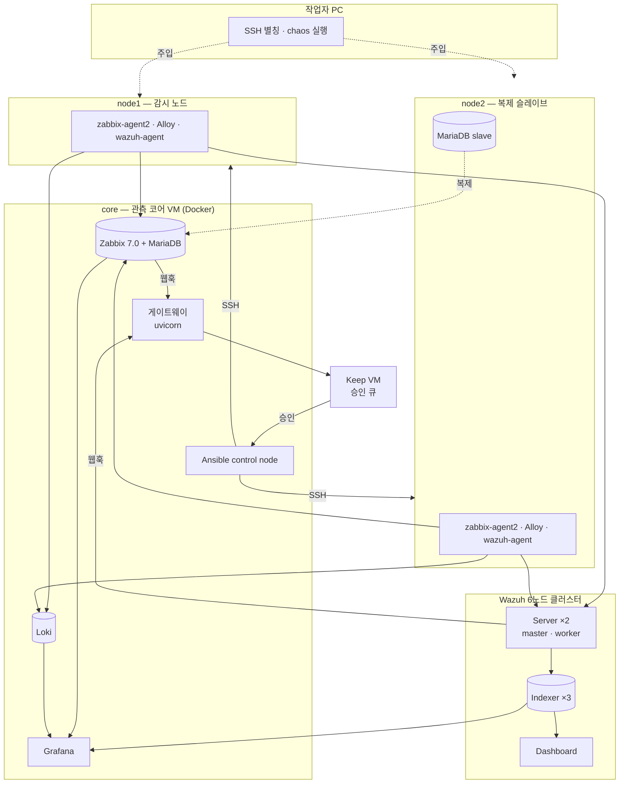
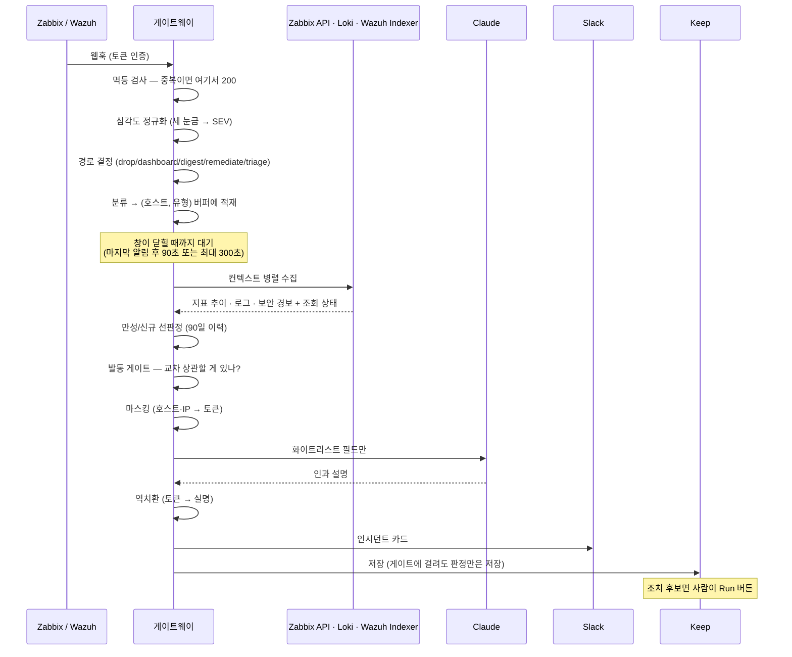

# 구조 — 무엇이 어디에 있고 알림 하나가 어떻게 흐르는가

코드를 고치기 전에 이 문서를 봅니다. 세부 배선은 각 디렉토리의 가이드에 있고, 여기는
**전체 모양과 용어**입니다.

## 1. 랩 토폴로지

**리포가 있는 곳은 `core`와 Keep VM 둘뿐입니다.** 나머지 VM에서는 스크립트를 그때그때
올려 씁니다. 호스트 이름·주소 대응표는 [`01-build/hosts.md`](01-build/hosts.md).

## 2. 알림 하나의 생애

**여기서 LLM이 등장하는 곳은 한 군데뿐이고, 그 앞뒤가 전부 규칙입니다.**
어떤 규칙이 어디에 있는지는 [`02-design/rules-inventory.md`](02-design/rules-inventory.md).

## 3. 계층으로 보면

| 계층 | 무엇 | 어디 |
|---|---|---|
| **수집** | zabbix-agent2(지표) · Alloy(로그) · wazuh-agent(보안) | `ansible/` |
| **저장** | Zabbix+MariaDB · Loki · Wazuh Indexer | `lab/` |
| **표현** | Grafana 대시보드 (통합 관제 · MSP · 리포트) | `lab/grafana/` |
| **판단** | 게이트웨이 — 정규화·분류·병합·선판정·게이트 | `bot/gateway/` |
| **설명** | LLM 어댑터 (Claude → Ollama → 열화) | `bot/gateway/llm.py` |
| **반출** | Slack · Keep. 마스킹을 통과한 것만 | `bot/gateway/{slack,keep,masking}.py` |
| **조치** | Ansible 플레이북 (가역·멱등·조치 후 재검증) | `ansible/` |
| **승인** | Keep 워크플로 (시스템 변경 · 고객 발송) | `keep/workflows/` |
| **주입** | chaos 스크립트 | `chaos/` |

## 4. 용어

| 용어 | 뜻 |
|---|---|
| **SEV1~4 · NONE** | 세 시스템의 심각도를 접은 **통합 눈금**. 원본 값이 아님 |
| **인시던트(사건)** | 같은 호스트·같은 유형(또는 알려진 인과 조합)의 알림을 묶은 단위. **알림 ≠ 사건** |
| **브리지 룰** | 서로 다른 유형을 한 사건으로 묶어도 되는 **조합 목록**. "같이 볼 가치가 있다"는 의심만 담고 인과는 담지 않음 |
| **선판정** | 90일 이력 개수로 신규/재발/만성을 코드가 결정하는 것. LLM이 관여하지 않음 |
| **디바운스 창** | 흩어져 오는 알림을 기다렸다가 사건을 확정하는 시간. **30초 KPI는 이 창이 닫힌 뒤부터 잼** |
| **게이트** | 비싼 것(LLM·심층조사·조치)을 언제 쓸지 정하는 규칙 |
| **열화(degraded)** | LLM이 **전부** 실패해 코드 판정만 회신한 상태. 주 경로만 실패한 것은 열화가 아님 |
| **조회 상태** | `ok` / `unavailable`(실패) / `disabled`(미배선). **"신호 없음"과 "못 봄"을 구분** |
| **FQDN 정규화** | 세 에이전트가 같은 호스트를 같은 이름으로 부르게 맞추는 것. 병합과 드릴다운의 전제조건 |
| **scope / automate** | Zabbix 트리거 태그. `scope=notify_only`가 `automate`를 이겨 조치 경로를 차단 |
| **HITL** | 사람이 승인 버튼을 눌러야 조치가 실행되는 구조 |

## 5. 자주 헷갈리는 구분

- **알림(alert) ≠ 사건(incident)** — 사건 하나에 알림이 여럿입니다. KPI도 사건 기준입니다.
- **"3소스"의 두 가지 의미** — 세 곳을 **조회**한다는 뜻이지, 세 시스템의 알림이 한 사건으로
  **병합**된다는 뜻이 아닙니다. 정확히는 **"두 소스가 사건을 만들고, 세 소스가 사건을
  설명한다"** 입니다 —
  [`03-pitfalls/structural-gaps.md#g4`](03-pitfalls/structural-gaps.md).
- **Wazuh 레벨 ≠ Zabbix 심각도** — 0~15와 0~5는 별개 눈금입니다. 단일 정렬 패널을 만들면 안 됩니다.
- **승인 게이트 ≠ 안전 게이트** — 앞엣것은 "사람이 눌러야 한다", 뒤엣것은 "엉뚱한 알림에서
  눌러도 아무 일 없다"입니다.
