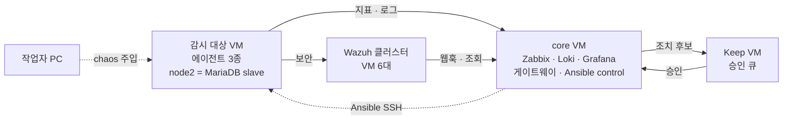
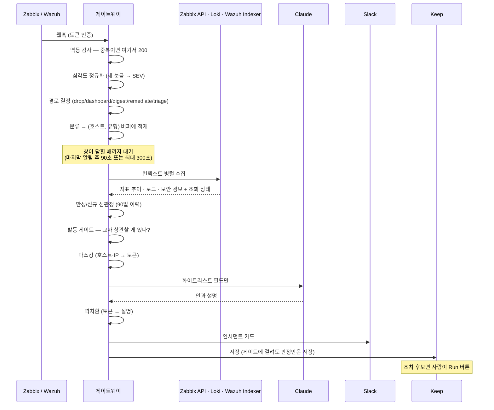

# 구조 — 전체 아키텍처 및 알림 흐름 가이드

소스 코드를 수정하기 전 참고하는 문서입니다. 각 디렉토리 가이드에서 세부 배선을 다루며, 본 문서는 **전체 시스템 구조 및 핵심 용어**를 정의합니다.

## 1. 전체 아키텍처 개요

**다이어그램 설명** — 왼쪽에서 오른쪽으로 알림(Alert) 데이터가 흐르는 구조입니다. 중앙 게이트웨이 내부의 **점선 상자는 판단 모듈**을 나타내며, 실선 상자는 앞뒤 단계의 데이터 수집 및 통신 영역을 의미합니다. 주요 판단 로직은 모두 코드 기반으로 동작하며, LLM은 최종 단계에서 설명(Interpretation) 생성 용도로만 활용됩니다.

신속 분석(Claude/Ollama)과 심층 조사(HolmesGPT) 모듈이 **분리 구성된 이유**는 실행 시간 예산(Time Budget)의 차이 때문입니다. 신속 분석은 30초 이내에 사용자에게 1차 분석 결과를 제공하고, 심층 조사는 분 단위 연산을 거쳐 상세 분석 결과를 동일 스레드에 추가 기재합니다. 상호 배타적 선택이 아닌 연계 역할 분담 구조입니다.

### 영역별 상세 문서 매핑

본 다이어그램은 전체 조망을 위한 지도이며, 각 구성 요소를 다루는 상세 정의는 아래 개별 문서에서 관리합니다.

| 다이어그램 영역 | 주요 다루는 내용 | 참조 문서 |
|---|---|---|
| 수집 (에이전트 3종) | 배포 · 자동 등록 · FQDN 정규화 | [`ansible/DEPLOY_GUIDE.md`](../ansible/DEPLOY_GUIDE.md) |
| 수집 (Zabbix·Loki·Wazuh·Grafana) | 구축 절차 · 데이터 소스 · 대시보드 | [`01-build/01-observability-core.md`](01-build/01-observability-core.md) |
| 판단 — 심각도 정규화 | 3개 관측 시스템 심각도를 단일 SEV로 통합 | [`02-design/severity-normalization.md`](02-design/severity-normalization.md) |
| 판단 — 병합·선별·발동 게이트 | 규칙 전수 항목 및 적용 순서 | [`02-design/rules-inventory.md`](02-design/rules-inventory.md) |
| 판단 — 마스킹·소스 상태 | 데이터 반출 및 비활성화 기준 | [`02-design/llm-data-contract.md`](02-design/llm-data-contract.md) |
| 신속 분석 | 모델 경로 · 폴백(Fallback) · 열화 처리 | [`02-design/decisions/adr-005-llm-path.md`](02-design/decisions/adr-005-llm-path.md) |
| 심층 조사 | 하이브리드 방식 채택 사유 | [`02-design/decisions/adr-002-holmesgpt.md`](02-design/decisions/adr-002-holmesgpt.md) |
| 관제·조치 | 승인 게이트 및 조치 후 자동 재검증 | [`keep/KEEP_GUIDE.md`](../keep/KEEP_GUIDE.md) |

*참고*: VM별 상세 컴포넌트 배치는 §2, 시간 순서 및 디바운스 대기 제어는 §3, 본 구조의 한계점은 [`03-pitfalls/`](03-pitfalls/README.md) 문서를 참조합니다.

## 2. 랩 토폴로지 (Lab Topology)

§1이 **신호 및 데이터 흐름**을 나타낸다면, 본 절은 **해당 컴포넌트가 배치된 실제 인프라 구성**을 나타냅니다.

| VM 명칭 | 배치된 컴포넌트 | 구성 이유 및 역할 |
|---|---|---|
| **core** | Zabbix + MariaDB · Loki · Grafana · 게이트웨이 · Ansible control node | 관측 코어를 단일 Compose로 묶고, 게이트웨이가 관련 API를 로컬에서 호출합니다. Ansible Control Node를 통합 배치하여 **감시 대상 시스템 변경 없이 코드로 배포 및 관리**합니다. |
| **감시 대상 VM** | zabbix-agent2 · Alloy · wazuh-agent (node2: MariaDB Slave 추가) | 3종 에이전트가 **동일한 FQDN**을 사용하도록 배포합니다. 호스트 식별자가 다를 경우 단일 호스트 기반 관측 시점을 유지할 수 없습니다. |
| **Wazuh 클러스터** | Indexer ×3 · Server ×2 (Master/Worker) · Dashboard ×1 | 운영 환경 구성을 1:1로 미러링합니다. 단일 호스트 컨테이너 구성 시 실환경과 다른 구조적 문제가 발생할 수 있습니다. |
| **Keep VM** | Keep (백엔드·UI·WebSocket) | 승인 UI는 관측 코어 장애 시에도 독립 동작해야 하며, 공식 배포 스펙상 별도 Compose 구성을 권장합니다. |

*소스 코드 저장소(Repository)는 `core` 및 Keep VM 두 곳에만 존재합니다.* 기타 VM에서는 필요 시 스크립트를 수시로 전송하여 실행합니다. 호스트명 및 IP 주소 매핑 정보는 [`01-build/hosts.md`](01-build/hosts.md)를 참조합니다.

## 3. 알림 라이프사이클 (Alert Lifecycle)

**전체 흐름 중 LLM이 개입하는 구간은 단 한 곳이며, 그 앞뒤의 전/후처리는 모두 코드 기반 규칙으로 실행됩니다.**
각 규칙의 구체적 정의 및 적용 위치는 [`02-design/rules-inventory.md`](02-design/rules-inventory.md) 문서를 참조합니다.

## 4. 계층별 구조 (Layered Architecture)

| 계층 | 역할 및 주요 기능 | 관련 디렉토리/파일 |
|---|---|---|
| **수집** | zabbix-agent2 (지표) · Alloy (로그) · wazuh-agent (보안) | `ansible/` |
| **저장** | Zabbix+MariaDB · Loki · Wazuh Indexer | `lab/` |
| **표현** | Grafana 대시보드 (통합 관제 · MSP · 리포트) | `lab/grafana/` |
| **판단** | 게이트웨이 — 정규화·분류·병합·선판정·게이트 | `bot/gateway/` |
| **설명** | LLM 어댑터 (Claude → Ollama → 열화 처리) | `bot/gateway/llm.py` |
| **반출** | Slack · Keep (마스킹 통과 데이터만 반출) | `bot/gateway/{slack,keep,masking}.py` |
| **조치** | Ansible 플레이북 (가역성·멱등성·조치 후 재검증) | `ansible/` |
| **승인** | Keep 워크플로 (시스템 변경 및 고객 통보 승인) | `keep/workflows/` |
| **주입** | Chaos 스크립트 | `chaos/` |

## 5. 핵심 용어 정의

| 용어 | 정의 및 설명 |
|---|---|
| **SEV1~4 · NONE** | 3개 관측 시스템의 심각도를 하나로 표준화한 **통합 심각도 눈금** (원본값과 다름) |
| **인시던트(사건)** | 동일 호스트 및 동일 유형(또는 정의된 인과 관계)의 알림을 하나로 그룹화한 단위 (**알림 ≠ 사건**) |
| **브리지 룰 (Bridge Rule)** | 서로 다른 유형의 알림을 하나의 사건으로 그룹화하기 위한 **연관 규칙 목록** (인과관계 단정이 아닌 단순 연관 가능성 정의) |
| **선판정** | 최근 90일간의 발생 이력 건수를 기반으로 신규/재발/만성 여부를 코드 로직으로 결정하는 절차 (LLM 미개입) |
| **디바운스 창 (Debounce Window)** | 분산 수신되는 알림을 대기하여 사건 단위를 확정하는 시간 범위 (**30초 측정 KPI 기준점은 해당 창이 종료된 시점부터 적용**) |
| **게이트 (Gate)** | 리소스 소모가 큰 기능(LLM 호출, 심층 조사, 자동 조치)의 실행 여부를 결정하는 조건 규칙 |
| **열화 (Degraded)** | LLM 호출이 **전면 실패**하여 코드 기반 판정 결과만 반환된 상태 (주 경로 실패 후 폴백 성공 시에는 열화로 간주하지 않음) |
| **조회 상태** | `ok` / `unavailable` (조회 실패) / `disabled` (미연동) 구분 표기 (**"정상 신호 없음"과 "시스템 조회 불가" 상태를 구별**) |
| **FQDN 정규화** | 3종 에이전트가 동일 호스트를 일관된 명칭으로 식별하도록 정제하는 작업 (알림 병합 및 드릴다운의 전제조건) |
| **scope / automate** | Zabbix 트리거 태그 명칭. `scope=notify_only` 설정이 `automate`보다 우선 적용되어 조치 실행을 차단 |
| **HITL (Human-in-the-Loop)** | 사용자(담당자)의 명시적 승인 클릭을 통해서만 조치가 실행되는 제어 방식 |

## 6. 주요 개념 구분

- **알림 (Alert) vs 사건 (Incident)** — 하나의 사건 내에 복수의 알림이 포함될 수 있으며, 모든 지표 및 KPI 산출은 사건 단위로 측정합니다.
- **"3개 소스 연동"의 명확한 의미** — 3개 관측 시스템을 **통합 조회**한다는 의미이며, 3개 시스템의 알림이 반드시 하나의 사건으로 **병합**되는 것은 아닙니다. 정확한 개념은 **"2개 소스가 사건을 생성하고, 3개 소스가 사건을 종합 설명한다"** 입니다 ([`03-pitfalls/structural-gaps.md`](03-pitfalls/structural-gaps.md) G4 항목 참조).
- **Wazuh 경보 레벨 vs Zabbix 심각도** — Wazuh (0~15)와 Zabbix (0~5)는 별개의 평가 눈금이므로 단순 단일 정렬 패널로 통합 구성하지 않습니다.
- **승인 게이트 vs 안전 게이트** — 승인 게이트는 "담당자 승인 필수"를 의미하며, 안전 게이트는 "잘못된 알림 상황에서 승인하되 시스템 영향이 없도록 보호"하는 메커니즘을 의미합니다.